<div align="center">

# 🎵 生成音效的 FFmpeg 命令

### 使用 FFmpeg 为你的 Remotion 视频创建专业音效

[](https://ffmpeg.org/)
[]()
[](https://www.remotion.dev/docs/audio)

---

## 📚 目录

</div>

- [基础音效生成](#-基础音效生成)
- [进阶音效合成](#-进阶音效合成)
- [运动相机视频音效](#-运动相机视频音效)
- [完整音频序列](#-完整音频序列)

---

<div align="center">

## 🔊 基础音效生成

</div>

### 1️⃣ 生成简单的蜂鸣声

> 📢 **用途**: 提示音、警报音、UI反馈

```bash
ffmpeg -f lavfi -i "sine=frequency=1000:duration=0.5" beep.wav
```

**参数说明**:
| 参数 | 值 | 说明 |
|:---|:---|:---|
| `frequency` | 1000 | 频率（Hz），数值越高音调越高 |
| `duration` | 0.5 | 时长（秒） |

---

### 2️⃣ 生成扫描音效（频率变化）

> 🔍 **用途**: 扫描、检测、科技感音效

```bash
ffmpeg -f lavfi -i "sine=frequency=200:duration=2" \
  -af "volume=0.3" scan.wav
```

**参数说明**:
| 参数 | 值 | 说明 |
|:---|:---|:---|
| `frequency` | 200 | 起始频率（低频更有科技感） |
| `duration` | 2 | 扫描时长 |
| `volume` | 0.3 | 音量（0-1，建议 0.3 避免过响） |

---

### 3️⃣ 生成白噪音

> 📺 **用途**: 静电噪音、电视雪花、风声

```bash
ffmpeg -f lavfi -i "color=c=black:s=1920x1080:d=2" \
  -f lavfi -i "anoisesrc=duration=2" noise.wav
```

---

### 4️⃣ 合成多个音效

> 🎛️ **用途**: 复杂音效组合

```bash
# 生成基础音效
ffmpeg -f lavfi -i "sine=frequency=440:duration=0.2" tone1.wav
ffmpeg -f lavfi -i "sine=frequency=880:duration=0.3" tone2.wav

# 合并
ffmpeg -i tone1.wav -i tone2.wav \
  -filter_complex amix=inputs=2:duration=first:dropout_transition=0 \
  combined.wav
```

---

### 5️⃣ 添加淡入淡出

> 🎚️ **用途**: 平滑音效过渡、避免爆音

```bash
ffmpeg -i input.wav \
  -af "afade=t=in:st=0:d=0.1,afade=t=out:st=0.4:d=0.1" \
  output.wav
```

**参数说明**:
| 参数 | 值 | 说明 |
|:---|:---|:---|
| `t=in` | - | 淡入类型 |
| `st=0` | 0 | 开始时间（秒） |
| `d=0.1` | 0.1 | 持续时间（秒） |
| `t=out` | - | 淡出类型 |
| `st=0.4` | 0.4 | 开始淡出时间 |

---

<div align="center">

## 🎬 进阶音效合成

</div>

### 🔀 音效叠加技巧

```mermaid
graph LR
    A[生成基础音效] --> B[调整音量]
    B --> C[添加淡入淡出]
    C --> D[叠加其他音效]
    D --> E[最终混音]
```



### 📊 常用频率参考

| 效果 | 频率范围 (Hz) | 示例 |
|:---|:---:|:---|
| 🔔 **提示音** | 800-1200 | `sine=frequency=1000` |
| 🔔 **警告音** | 400-600 | `sine=frequency=500` |
| 🔔 **低音** | 100-200 | `sine=frequency=150` |
| 🔔 **高音** | 2000-4000 | `sine=frequency=3000` |
| 🔔 **超声波** | 15000+ | `sine=frequency=18000` |

---

<div align="center">

## 📷 运动相机视频音效

</div>

> 为你的运动相机产品展示视频创建专业音效序列

---

### 🎬 场景1: 产品亮相 - 深沉揭示音

<details>
<summary><b>🎵 音效描述</b></summary>

- 📉 低频渐入音
- ⏱️ 1秒时长
- 📈 淡入淡出效果
- 🎯 用途：产品首次展示时的震撼效果

</details>

```bash
ffmpeg -f lavfi -i "sine=frequency=150:duration=1" \
  -af "afade=t=in:st=0:d=0.3,afade=t=out:st=0.7:d=0.3" \
  scene1_reveal.wav
```

---

### 🔄 场景2-7: 转场音效 - 高频提示音

<details>
<summary><b>🎵 音效描述</b></summary>

- 🔔 清脆的提示音
- ⏱️ 0.15秒短促
- 🔉 低音量（0.2）
- 🎯 用途：场景切换时的专业过渡

</details>

```bash
ffmpeg -f lavfi -i "sine=frequency=880:duration=0.15" \
  -af "volume=0.2" \
  transition_beep.wav
```

---

### 🏁 场景8: 结尾 - 收束音效

<details>
<summary><b>🎵 音效描述</b></summary>

- 🎵 中频终止音
- ⏱️ 0.5秒时长
- 📉 淡出效果
- 🎯 用途：视频结尾的完美收尾

</details>

```bash
ffmpeg -f lavfi -i "sine=frequency=440:duration=0.5" \
  -af "afade=t=out:st=0.3:d=0.2" \
  scene8_end.wav
```

---

<div align="center">

## 🎼 完整音频序列

</div>

> 将所有场景音效合并为一个完整的音轨文件

### 📋 生成步骤

```mermaid
graph LR
    A[生成所有场景音效] --> B[创建40秒静音轨道]
    B --> C[在对应时间点<br/>叠加音效]
    C --> D[输出完整音轨]
```



---

### 🔧 完整合成命令

```bash
# 生成所有场景音效（先运行上面的各个命令）

# 合并为完整音轨（使用 silent 填充空白）
ffmpeg -f lavfi -i "anullsrc=r=44100:cl=stereo" -t 40 \
  -i scene1_reveal.wav \
  -i transition_beep.wav \
  -i scene8_end.wav \
  -filter_complex "\
    [0:a][1:a]alooverlay=enable='between(t,0,5)':eval=init[sa1];\
    [sa1][2:a]alooverlay=enable='between(t,5,39)':w=120[sa2];\
    [sa2][3:a]alooverlay=enable='between(t,39,40)'[saout]\
  " \
  -map "[saout]" complete_audio.wav
```

---

### 📊 时间轴布局

| 时间 | 音效 | 场景 |
|:---:|:---|:---|
| 0-5s | 🎬 产品亮相音 | 场景1 |
| 5s | 🔔 转场提示音 | 场景1→2 |
| 10s | 🔔 转场提示音 | 场景2→3 |
| 15s | 🔔 转场提示音 | 场景3→4 |
| 20s | 🔔 转场提示音 | 场景4→5 |
| 25s | 🔔 转场提示音 | 场景5→6 |
| 30s | 🔔 转场提示音 | 场景6→7 |
| 35s | 🔔 转场提示音 | 场景7→8 |
| 39-40s | 🏁 结尾收束音 | 场景8 |

---

<div align="center">

## 💡 高级技巧

</div>

### 🎚️ 音量调节

```bash
# 调整音量为原音量的 50%
ffmpeg -i input.wav -af "volume=0.5" output.wav

# 提升 3dB
ffmpeg -i input.wav -af "volume=3dB" output.wav
```

### 🌊 回声效果

```bash
# 添加 0.5s 延迟的回声
ffmpeg -i input.wav -af "aecho=0.8:0.9:1000:0.3" output.wav
```

### 🎵 均衡器

```bash
# 增强 1000Hz 附近
ffmpeg -i input.wav -af "equalizer=f=1000:width_type=h:width=100:g=10" output.wav
```

### ⏱️ 变速不变调

```bash
# 1.5倍速
ffmpeg -i input.wav -filter_complex "atempo=1.5" output.wav

# 0.8倍速（慢速）
ffmpeg -i input.wav -filter_complex "atempo=0.8" output.wav
```

---

<div align="center">

## 📦 导出格式

</div>

### 🎵 推荐格式

| 格式 | 用途 | 质量 | 文件大小 |
|:---|:---|:---:|:---:|
| **WAV** | 编辑、制作 | ⭐⭐⭐⭐⭐ | 很大 |
| **MP3 (320k)** | 分发、播放 | ⭐⭐⭐⭐ | 小 |
| **AAC** | 在线流媒体 | ⭐⭐⭐⭐ | 很小 |
| **FLAC** | 无损存档 | ⭐⭐⭐⭐⭐ | 中等 |

### 🔄 格式转换示例

```bash
# WAV → MP3 (320kbps)
ffmpeg -i input.wav -codec:a libmp3lame -b:a 320k output.mp3

# WAV → AAC (高质量)
ffmpeg -i input.wav -codec:a aac -b:a 256k output.m4a

# WAV → FLAC (无损)
ffmpeg -i input.wav -codec:a flac output.flac
```

---

<div align="center">

## 🔗 相关资源

</div>

[](https://ffmpeg.org/documentation.html)
[](https://www.remotion.dev/docs/audio)

| 资源 | 链接 |
|:---|:---|
| 📚 [FFmpeg 官方文档](https://ffmpeg.org/documentation.html) | 完整的 FFmpeg 文档 |
| 🎵 [FFmpeg 音频滤镜](https://trac.ffmpeg.org/wiki/AudioFilters) | 所有音频滤镜列表 |
| 📖 [Remotion 音频文档](https://www.remotion.dev/docs/audio) | 在 Remotion 中使用音频 |

---

<div align="center">

## 🎓 快速参考

</div>

### ⌨️ 常用命令速查

| 任务 | 命令 |
|:---|:---|
| **蜂鸣音** | `ffmpeg -f lavfi -i "sine=frequency=1000:duration=0.5" beep.wav` |
| **调整音量** | `ffmpeg -i input.wav -af "volume=0.5" output.wav` |
| **淡入淡出** | `ffmpeg -i input.wav -af "afade=t=in:st=0:d=0.1,afade=t=out:st=0.4:d=0.1" output.wav` |
| **合并音效** | `ffmpeg -i tone1.wav -i tone2.wav -filter_complex amix=inputs=2 output.wav` |
| **转 MP3** | `ffmpeg -i input.wav -codec:a libmp3lame -b:a 320k output.mp3` |

---

<div align="center">

## 💡 提示和最佳实践

</div>

### ✅ 最佳实践

| 实践 | 说明 |
|:---|:---|
| 🔉 **使用低音量** | 音频叠加时容易过响，建议每个音效音量 0.2-0.3 |
| ⏱️ **添加淡入淡出** | 避免音频突然开始/结束的爆音 |
| 🎵 **使用 44.1kHz** | 标准音频采样率，兼容性最好 |
| 💾 **先导出 WAV** | 编辑时使用无损格式，最后再转有损格式 |
| 👂 **多试听** | 不同设备上测试音效效果 |

### ❌ 常见错误

| 错误 | 原因 | 解决方案 |
|:---|:---|:---|
| 音效太响 | 音量叠加 | 降低每个音轨的 volume 值 |
| 有爆音 | 没有淡入淡出 | 添加 afade 滤镜 |
| 音质差 | 采样率或码率太低 | 使用更高的采样率和码率 |
| 无法播放 | 格式不兼容 | 转换为 MP3 或 AAC |

---

<div align="center">

## 🎯 总结

```mermaid
graph LR
    A[基础音效] --> B[进阶合成]
    B --> C[场景音效]
    C --> D[完整序列]
    D --> E[导出分发]
```

</div>



### 📌 记住

1. 🎵 **从简单开始** - 先生成基础音效
2. 🎚️ **注意音量** - 避免过响和爆音
3. ✨ **添加过渡** - 淡入淡出让音效更专业
4. 🎧 **多测试** - 在不同设备上试听
5. 📦 **选择合适格式** - 编辑用 WAV，分发用 MP3

---

<div align="center">

## 🌟 开始创作你的音效吧！

Happy Sound Design! 🎵

Made with ❤️ for Remotion AI

</div>
