<div align="center">

# 🎬 Remotion AI - 运动相机产品展示动画

### 使用 Remotion + Three.js + React 创建的专业级运动相机产品展示视频

[](https://github.com/remotion-dev/remotion)
[](https://reactjs.org/)
[](https://threejs.org/)
[](LICENSE)


---

## ✨ 功能特性

</div>

> 这个项目展示了如何使用 **Remotion** 创建专业的产品展示视频

```mermaid
graph LR
    A[8个精心设计的场景] --> B[高精细度3D相机模型]
    B --> C[多种转场效果]
    C --> D[粒子特效系统]
    D --> E[完整的UI文字叠加]
    E --> F[动态背景颜色变化]
    F --> G[智能光照系统]
```



### 🎬 视频场景

| 场景 | 内容 | 时长 |
|:---|:---|:---:|
| 🎬 **产品亮相** | 相机 360° 旋转，标题动画 | 5秒 |
| 📊 **技术参数** | 4K 120fps / 5.3K 传感器 / 超广角 | 5秒 |
| 📷 **镜头特写** | f/1.8 大光圈 / 光学镜片 / 蓝宝石镀膜 | 5秒 |
| 🏃 **极限运动** | IP68 防水 / -20° 耐低温 / 速度线特效 | 6秒 |
| 🔌 **接口展示** | Type-C / HDMI / 支架接口 | 5秒 |
| 🧠 **智能功能** | AI 追踪 / 电子防抖 / 语音控制 | 5秒 |
| 🏆 **品牌口号** | 用户评分 / 专业推荐 | 5秒 |
| 🛒 **结尾 CTA** | 产品价格 / 购买引导 | 4秒 |

---

<div align="center">

## 🚀 快速开始

</div>

### 📋 前置要求

| 要求 | 版本 |
|:---|:---:|
| **Node.js** | >= 18.0.0 |
| **包管理器** | npm / yarn / pnpm |

---

### 🛠️ 安装步骤

#### 1️⃣ 克隆仓库

```bash
git clone https://github.com/hcx185381/remotion_AI.git
cd remotion_AI
```

#### 2️⃣ 安装依赖

```bash
npm install
```

> 💡 **提示**：`node_modules` 文件夹会被自动下载，包含项目所需的所有依赖包

#### 3️⃣ 启动开发服务器

```bash
npm start
```

#### 4️⃣ 在浏览器中查看

```
打开 http://localhost:3000
选择 "ActionCameraShowcase" 视频
```

---

<div align="center">

## 📖 使用方法

</div>

### 🎬 预览视频

```mermaid
graph LR
    A[在 Remotion Studio 中<br/>选择 ActionCameraShowcase] --> B[使用时间轴拖动<br/>查看不同场景<br/>0-1200 帧]
    B --> C[点击播放按钮<br/>预览动画]
```



### 🎥 渲染视频

#### 🎬 渲染为 MP4（高质量）

```bash
npx remotion render ActionCameraShowcase output.mp4 --codec=h264 --crf=18
```

#### 🖼️ 渲染为视频序列

```bash
npx remotion render ActionCameraShowcase output/frame_%04d.png --sequence
```

#### ✂️ 渲染特定场景

```bash
# 只渲染场景 1（前 150 帧）
npx remotion render ActionCameraShowcase scene1.mp4 --frames=0-150
```

### 🎵 添加音频

```mermaid
graph LR
    A[1️⃣ 下载背景音乐<br/>建议：Cinematic / Technology 风格] --> B[2️⃣ 放到 public/ 文件夹]
    B --> C[3️⃣ 重命名为 background.mp3]
    C --> D[4️⃣ 刷新浏览器<br/>音频会自动加载]
```



#### 🎶 推荐音乐网站

| 网站 | 链接 | 特点 |
|:---|:---|:---|
| **Pixabay Music** | [pixabay.com/music](https://pixabay.com/music) | 免费音乐 |
| **Bensound** | [bensound.com](https://www.bensound.com) | 免费背景音乐 |
| **YouTube Audio Library** | [youtube.com/audiolibrary](https://www.youtube.com/audiolibrary) | YouTube 官方音频库 |

---

<div align="center">

## 📁 项目结构

</div>

```
remotion_AI/
├── public/                    📁 静态资源（音频、图片等）
├── src/
│   ├── ActionCameraShowcase.tsx     🎬 主组件（运动相机展示）
│   ├── Root.tsx                     🚪 所有视频的入口
│   ├── index.ts                     📍 应用入口
│   ├── components/                  🧩 3D 组件
│   │   ├── CameraModel.tsx          📷 高精细度相机模型
│   │   ├── SceneLighting.tsx        💡 动态光照系统
│   │   └── ParticleEffects.tsx      ✨ 粒子特效
│   ├── ui/                          🎨 2D UI 组件
│   │   └── TextOverlay.tsx          📝 文字叠加层
│   ├── utils/                       🔧 工具函数
│   │   ├── sceneAnimations.ts       🎭 场景动画配置
│   │   └── audioGenerator.ts        🎵 音频生成工具
│   ├── RemotionIntroduction.tsx     📖 其他演示视频
│   ├── InstallationDemo.tsx
│   ├── ProductShowcase.tsx
│   ├── BouncingSphere.tsx
│   └── RotatingCube.tsx
├── package.json               📦 项目依赖
├── tsconfig.json              ⚙️ TypeScript 配置
├── remotion.config.ts         🔧 Remotion 配置
└── README.md                  📄 本文件
```

---

<div align="center">

## 🛠️ 技术栈

</div>

| 技术 | 版本 | 用途 |
|:---|:---:|:---|
| **Remotion** | 4.0.414 | 视频创建框架 |
| **React** | 18.3.1 | UI 框架 |
| **Three.js** | 0.182.0 | 3D 图形库 |
| **@react-three/fiber** | 8.16.8 | React Three.js 绑定 |
| **@remotion/three** | 4.0.414 | Remotion + Three.js 集成 |
| **TypeScript** | - | 类型安全 |

---

<div align="center">

## 🎓 学习 Remotion

</div>

### 📚 核心概念

#### 1️⃣ 所有动画由帧驱动

```tsx
import { useCurrentFrame, interpolate } from "remotion";

export const MyAnimation = () => {
  const frame = useCurrentFrame(); // 获取当前帧
  const opacity = interpolate(frame, [0, 30], [0, 1]); // 0-30 帧淡入

  return <div style={{ opacity }}>Hello!</div>;
};
```

#### 2️⃣ 禁止使用 CSS 动画

```tsx
// ❌ 错误：CSS 动画不会被渲染
<div style={{ transition: 'opacity 1s' }} />

// ✅ 正确：使用 Remotion 动画函数
<div style={{ opacity: interpolate(frame, [0, 30], [0, 1]) }} />
```

#### 3️⃣ 3D 场景使用 ThreeCanvas

```tsx
import { ThreeCanvas } from "@remotion/three";

<ThreeCanvas width={1920} height={1080}>
  <mesh>
    <boxGeometry args={[1, 1, 1]} />
    <meshStandardMaterial color="hotpink" />
  </mesh>
</ThreeCanvas>
```

---

### 🔗 推荐资源

<div align="center">

[](https://www.remotion.dev/docs)
[](https://github.com/remotion-dev/remotion)
[](https://remotion.dev/discord)
[](https://github.com/remotion-dev/skills)

| 资源 | 链接 |
|:---|:---|
| 📚 [Remotion 官方文档](https://www.remotion.dev/docs) | 完整的 API 文档和教程 |
| 🎬 [Remotion GitHub](https://github.com/remotion-dev/remotion) | 源代码和问题跟踪 |
| 🎮 [Remotion Discord](https://remotion.dev/discord) | 社区讨论和支持 |
| 📖 [Remotion 最佳实践 Skill](https://github.com/remotion-dev/skills) | Remotion 最佳实践集合 |

</div>

---

<div align="center">

## 🎨 自定义和扩展

</div>

### 📷 修改相机模型

> 编辑 `src/components/CameraModel.tsx`：

- 📏 修改机身尺寸
- 🎨 调整材质颜色
- ✨ 添加更多细节

### 📝 修改文字内容

> 编辑 `src/ui/TextOverlay.tsx`：

- 🏷️ 更改产品名称
- 📊 调整技术参数
- ⏱️ 修改场景时长

### ➕ 添加新场景

```mermaid
graph LR
    A[1️⃣ 在 sceneAnimations.ts<br/>中添加新场景配置] --> B[2️⃣ 在 TextOverlay.tsx<br/>中添加对应的文字]
    B --> C[3️⃣ 在 Root.tsx<br/>中更新 durationInFrames]
```



---

<div align="center">

## 🐛 常见问题

</div>

### ❓ Q: 为什么我的视频没有声音？

**A:** 需要手动添加音频文件到 `public/background.mp3`。参考上面的"添加音频"部分。

### ❓ Q: 如何调整视频的帧率或分辨率？

**A:** 在 `src/Root.tsx` 中修改 Composition 的 `fps`、`width`、`height` 属性。

### ❓ Q: 为什么渲染很慢？

**A:** Remotion 需要逐帧渲染视频。可以：
- 降低分辨率
- 减少复杂度
- 使用 `--concurrency=4` 并发渲染

### ❓ Q: 可以在手机上查看吗？

**A:** 需要部署到支持的平台，如 Vercel。参考上面"部署到 Vercel/Netlify"部分。

---

<div align="center">

## 🌍 部署到线上

</div>

### 🚀 方式 1：部署到 Vercel（推荐）

```bash
# 安装 Vercel CLI
npm i -g vercel

# 部署
vercel
```

部署后会得到一个域名，比如：`https://remotion-ai.vercel.app`

### 🎬 方式 2：渲染视频并上传

```bash
# 渲染视频
npx remotion render ActionCameraShowcase showcase.mp4

# 上传到
# - B站（bilibili）
# - YouTube
# - 视频号
```

---

<div align="center">

## 📝 许可证

</div>

本项目采用 **ISC 许可证** - 详见 [LICENSE](LICENSE) 文件

---

<div align="center">

## 🤝 贡献

</div>

欢迎提交 Issue 和 Pull Request！

如果你想改进这个项目：

```mermaid
graph LR
    A[1️⃣ Fork 本仓库] --> B[2️⃣ 创建特性分支<br/>git checkout -b feature/AmazingFeature]
    B --> C[3️⃣ 提交更改<br/>git commit -m 'Add some AmazingFeature']
    C --> D[4️⃣ 推送到分支<br/>git push origin feature/AmazingFeature]
    D --> E[5️⃣ 开启 Pull Request]
```



---

<div align="center">

## 💡 提示和技巧

</div>

### ⚡ 性能优化

| 优化方式 | 说明 |
|:---|:---|
| ✅ 使用 `extrapolateRight: "clamp"` | 限制计算范围 |
| ✅ 条件渲染粒子效果 | 只在需要时渲染 |
| ✅ 复用几何体和材质 | 避免重复创建 |
| ✅ 避免在渲染循环中创建新对象 | 提升性能 |

### 🔍 调试技巧

```mermaid
graph LR
    A[使用 Remotion Studio 的<br/>实时预览功能] --> B[查看 Console 的错误信息]
    B --> C[逐个场景测试<br/>而不是整个视频]
```



---

<div align="center">

## 📞 联系方式

</div>

| 平台 | 链接 |
|:---|:---|
| **GitHub** | [@hcx185381](https://github.com/hcx185381) |
| **项目地址** | https://github.com/hcx185381/remotion_AI |

---

<div align="center">

## 🙏 致谢

本项目基于以下优秀技术：

[](https://github.com/remotion-dev/remotion)
[](https://github.com/mrdoob/three.js)
[](https://github.com/pmndrs/react-three-fiber)
[](https://claude.com/claude-code)

- [Remotion](https://github.com/remotion-dev/remotion) - 强大的 React 视频框架
- [Three.js](https://github.com/mrdoob/three.js) - 优秀的 3D 图形库
- [React Three Fiber](https://github.com/pmndrs/react-three-fiber) - React Three.js 绑定
- [Claude Code](https://claude.com/claude-code) - AI 辅助开发工具

---

## 🌟 如果这个项目对你有帮助，请给一个 Star！

---

<div align="center">

Made with ❤️ by [hcx185381](https://github.com/hcx185381)

</div>
