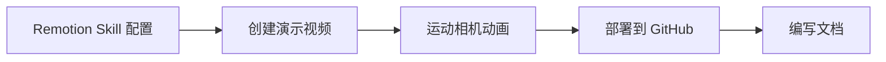
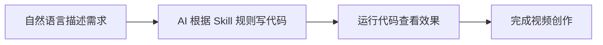
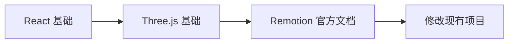
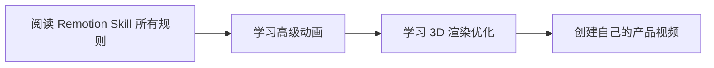
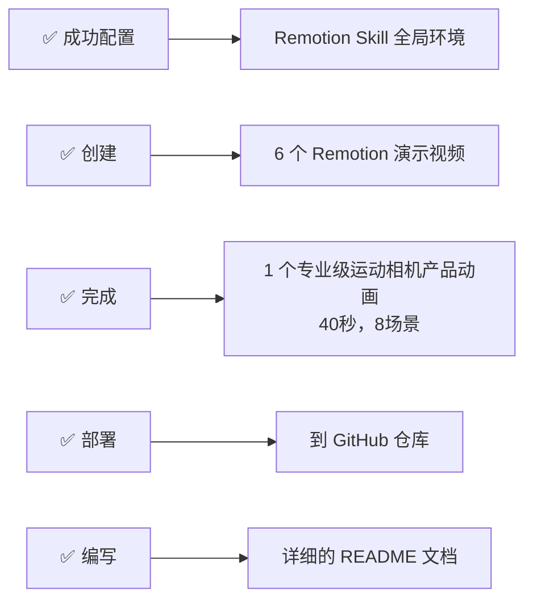
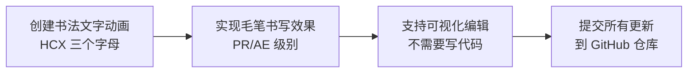
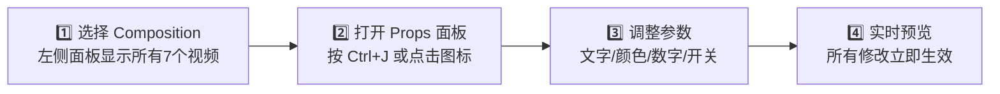
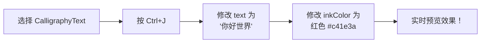
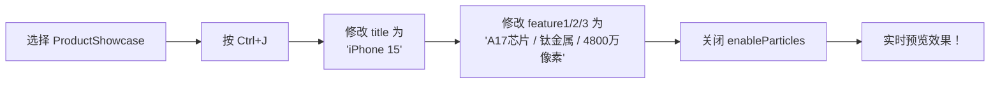
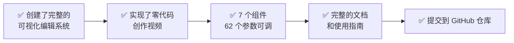

# 🎬 Remotion AI 项目开发 - 完整会话记录

<div align="center">

**日期**: `2026年2月1日`
**项目**: 🏷️ 运动相机产品展示动画
**仓库**: [https://github.com/hcx185381/remotion_AI](https://github.com/hcx185381/remotion_AI)

[](https://github.com/remotion-dev/remotion)
[](https://reactjs.org/)
[](https://threejs.org/)

---

### 📋 会话概览

</div>

---

> **本次会话核心成果** ✨



**我们完成了** ✅

| 任务 | 状态 | 描述 |
|:---:|:---:|:---|
| 🛠️ | ✅ | 安装并配置 Remotion Skill |
| 🎥 | ✅ | 创建多个 Remotion 演示视频 |
| 🎬 | ✅ | 创建专业运动相机产品展示动画（8场景，40秒） |
| 📤 | ✅ | 部署到 GitHub 仓库 |
| 📝 | ✅ | 编写详细的 README 文档 |

---

## 🎯 任务完成清单

### 1️⃣ Remotion Skill 配置

> 💡 **什么是 Remotion Skill？**
>
> Remotion Skill 是一个 AI 助手技能包，包含 **32 个规则文件**，涵盖 3D、动画、音频、视频、转场等所有 Remotion 最佳实践。

**配置步骤**

```json
{
  "skills": [
    {
      "name": "remotion-best-practices",
      "path": "E:\\remotion\\skills\\skills\\remotion"
    }
  ]
}
```

**配置文件位置**: `C:\Users\admin\AppData\Roaming\Claude\claude_desktop_config.json`

---

### 2️⃣ 基础演示视频创建

#### 📁 文件结构

```
E:\remotion\remotion-demo\
├── src/
│   ├── Root.tsx                      ⭐ 视频入口
│   ├── RemotionIntroduction.tsx      📖 Remotion 介绍视频
│   ├── InstallationDemo.tsx          🛠️ 安装演示视频
│   ├── RotatingCube.tsx              🎲 旋转立方体 (3D)
│   ├── BouncingSphere.tsx           🏀 弹跳球体 (3D)
│   └── ProductShowcase.tsx           🍎 产品展示 (苹果风格)
```

#### 🎨 创建的代码文件

| 文件名 | 功能描述 | 特性 |
|:---|:---|:---|
| **RemotionIntroduction.tsx** | 介绍 Remotion 框架 | 标题淡入动画、特性列表展示、代码示例 |
| **InstallationDemo.tsx** | 演示安装过程 | 终端窗口动画、命令行逐步显示 |
| **RotatingCube.tsx** | 3D 旋转立方体 | ThreeCanvas、360° 旋转、缩放效果 |
| **BouncingSphere.tsx** | 弹跳球体 | 物理弹跳动画、地面反射、旋转效果 |
| **ProductShowcase.tsx** | 苹果风格产品展示 | 3D 设备模型、粒子系统、环形装饰 |

---

### 3️⃣ 运动相机产品展示动画 🎬

<div align="center">

### 🔥 核心项目

</div>

#### 📊 项目规格

| 属性 | 数值 |
|:---|:---:|
| **总时长** | ⏱️ 40秒（1200帧 @ 30fps） |
| **场景数量** | 🎬 8个 |
| **3D模型** | 📷 高精细度运动相机 |
| **转场效果** | ✨ 混合转场（淡入淡出、缩放、旋转、推拉） |

#### 📁 完整文件结构

```
remotion-demo/
├── src/
│   ├── ActionCameraShowcase.tsx        🎬 主组件
│   ├── components/
│   │   ├── CameraModel.tsx             📷 3D相机模型
│   │   ├── SceneLighting.tsx           💡 动态光照
│   │   └── ParticleEffects.tsx         ✨ 粒子特效
│   ├── ui/
│   │   └── TextOverlay.tsx             📝 文字叠加层
│   └── utils/
│       ├── sceneAnimations.ts          🎭 动画配置
│       └── audioGenerator.ts           🎵 音频生成工具
```

---

#### 🎬 8个场景详解

<details>
<summary><b>🎬 场景1: 产品亮相</b> (0-150帧 / 5秒)</summary>

- ✨ 相机从下方浮起，360° 旋转
- 📝 主标题: **"ACTION CAM X1"**
- 📝 副标题: **"重新定义运动拍摄"**
- 🔄 转场: 淡入 + 缩放
</details>

<details>
<summary><b>📊 场景2: 技术参数</b> (150-300帧 / 5秒)</summary>

- 🎯 正面定格展示
- 📋 参数: **4K 120fps** / **5.3K 传感器** / **180° 超广角**
- 🔄 转场: 推镜头
</details>

<details>
<summary><b>📷 场景3: 镜头特写</b> (300-450帧 / 5秒)</summary>

- 📐 侧移展示镜头
- 🔬 特性: **f/1.8 大光圈** / **8片镜片** / **蓝宝石镀膜**
- 🔄 转场: 侧向推拉
</details>

<details>
<summary><b>🏃 场景4: 极限运动</b> (450-630帧 / 6秒)</summary>

- 🌪️ 倾斜旋转 + 速度线特效
- 🏔️ 特性: **无畏挑战** / **IP68 防水** / **-20° 耐低温**
- 🔄 转场: 旋转切换
</details>

<details>
<summary><b>🔌 场景5: 接口展示</b> (630-780帧 / 5秒)</summary>

- 🔌 背面接口特写
- 🔗 特性: **Type-C** / **HDMI 2.1** / **通用支架**
- 🔄 转场: 缩放特写
</details>

<details>
<summary><b>🧠 场景6: 智能功能</b> (780-930帧 / 5秒)</summary>

- 💡 屏幕发光效果
- 🤖 特性: **AI 追踪** / **电子防抖 3.0** / **语音控制**
- 🔄 转场: 淡入淡出
</details>

<details>
<summary><b>🏆 场景7: 品牌口号</b> (930-1080帧 / 5秒)</summary>

- 💫 光环环绕相机
- 📝 口号: **"记录每一个精彩瞬间"**
- ⭐ 评分: ★★★★★ 4.9/5.0
- 🔄 转场: 缩小后退
</details>

<details>
<summary><b>🛒 场景8: 结尾CTA</b> (1080-1200帧 / 4秒)</summary>

- 🛍️ 产品信息 + 价格
- 📝 内容: **ACTION CAM X1** / **¥2,999 起** / **立即选购**
- 🔄 转场: 淡出至黑
</details>

---

#### 🔧 技术实现要点

> **3D 相机模型** (`CameraModel.tsx`)

| 组件 | 描述 | 参数 |
|:---|:---|:---|
| **机身** | 2×3.5×0.8 boxGeometry | metalness=0.95, roughness=0.15 |
| **镜头组件** | 多层圆柱 + 球面 | 光学玻璃材质 |
| **屏幕** | 动态发光效果 | 发光材质 |
| **按钮** | 红色快门 + 模式按钮 | 交互组件 |
| **接口** | USB-C + HDMI mini | 物理建模 |

> **动画系统** (`sceneAnimations.ts`)

```typescript
// 使用 spring() 实现弹性动画
const spring({
  frame, fps,
  config: { damping, mass, stiffness }
});

// 使用 interpolate() 实现平滑插值
const value = interpolate(frame, inputRange, outputRange);

// 场景自动切换逻辑
// 背景颜色动态插值
```

> **粒子特效** (`ParticleEffects.tsx`)

- ✨ 浮动粒子（场景1）
- 💨 速度线（场景4）
- ⚡ 条件渲染优化性能

> **文字动画** (`TextOverlay.tsx`)

4种动画类型：`fadeIn`, `slideUp`, `scaleIn`, `stagger`

---

## 🔧 关键技术决策

### 📦 依赖版本

```json
{
  "react": "18.3.1",
  "@react-three/fiber": "8.16.8",
  "@remotion/cli": "4.0.414",
  "@remotion/three": "4.0.414",
  "remotion": "4.0.414",
  "three": "0.182.0"
}
```

> ⚠️ **重要说明**
>
> - `@react-three/fiber` 9.x 需要 React 19
> - 使用 8.16.8 版本兼容 React 18
> - 安装时使用 `--legacy-peer-deps` 或 `--force`

### ⚙️ Remotion 配置

```typescript
import { Config } from "@remotion/cli/config";

Config.setVideoImageFormat("jpeg");
Config.setOverwriteOutput(true);
Config.setEntryPoint("./src/index.ts");
```

---

## 🐛 遇到的问题和解决方案

### ❌ 问题 1: 浏览器白屏

| 项目 | 内容 |
|:---|:---|
| **原因** | React 版本不兼容 |
| **解决** | 降级 `@react-three/fiber` 到 8.16.8 |

### ❌ 问题 2: interpolate 错误

| 项目 | 内容 |
|:---|:---|
| **错误信息** | `inputRange (2) and outputRange (3) must have the same length` |
| **原因** | 数组长度不匹配 |
| **解决** | 拆分为两个 interpolate 调用 |

### ❌ 问题 3: 没有声音

| 项目 | 内容 |
|:---|:---|
| **原因** | Remotion 默认不包含音频 |
| **解决** | 1. 下载音乐文件 → 2. 放到 `public/background.mp3` → 3. 使用 `<Audio src="/background.mp3" />` |

---

## 📦 部署流程

### 🔄 Git 配置

```bash
# 配置用户信息
git config --global user.name "hcx185381"
git config --global user.email "hcx185381@users.noreply.github.com"

# 创建 .gitignore
node_modules/
package-lock.json
dist/
*.mp4
```

### 📤 推送到 GitHub

```bash
git init
git add .
git commit -m "Initial commit: Remotion 运动相机产品展示动画"
git remote add origin https://github.com/hcx185381/remotion_AI.git
git branch -M main
git push -u origin main --force
```

---

## 📚 重要知识总结

### 🔮 Remotion Skill 详解

> **什么是 Skill?**

- 📦 一个包含 Remotion 最佳实践的代码库
- 📄 32 个规则文件，涵盖所有 Remotion 功能
- 🤖 帮助 AI 遵循 Remotion 规范写代码

**Skill 位置**: `E:\remotion\skills\skills\remotion\`

**使用方式**:
```bash
1️⃣ 克隆仓库: git clone https://github.com/remotion-dev/skills.git
2️⃣ 配置路径到 Claude Code
3️⃣ 用自然语言描述需求，AI 会根据 Skill 规则写代码
```

**Skill 包含的规则**:
- `rules/3d.md` - Three.js 使用规范
- `rules/animations.md` - 动画基础
- `rules/audio.md` - 音频处理
- `rules/transitions.md` - 转场效果
- 📚 等 32 个规则文件...

---

### 🎯 Remotion 核心规则

#### 1️⃣ 所有动画必须由 `useCurrentFrame()` 驱动

```tsx
const frame = useCurrentFrame();
const opacity = interpolate(frame, [0, 30], [0, 1]);
```

#### 2️⃣ 禁止使用 CSS 动画

```tsx
// ❌ 错误
<div style={{ transition: 'opacity 1s' }} />

// ✅ 正确
<div style={{ opacity: interpolate(frame, [0, 30], [0, 1]) }} />
```

#### 3️⃣ 3D 场景必须使用 ThreeCanvas

```tsx
<ThreeCanvas width={width} height={height}>
  <mesh>
    <boxGeometry args={[1, 1, 1]} />
    <meshStandardMaterial color="hotpink" />
  </mesh>
</ThreeCanvas>
```

#### 4️⃣ 禁止使用 `useFrame()` from @react-three/fiber

```tsx
// ❌ 错误
useFrame(({ clock }) => {
  meshRef.current.rotation.y = clock.getElapsedTime();
});

// ✅ 正确
const frame = useCurrentFrame();
const rotation = frame * 0.02;
```

---

## 📁 创建的所有文件

### 📄 源代码文件

| # | 文件名 | 描述 |
|:---:|:---|:---|
| 1 | `src/ActionCameraShowcase.tsx` | 主组件 |
| 2 | `src/components/CameraModel.tsx` | 3D相机 |
| 3 | `src/components/SceneLighting.tsx` | 光照系统 |
| 4 | `src/components/ParticleEffects.tsx` | 粒子特效 |
| 5 | `src/ui/TextOverlay.tsx` | 文字叠加 |
| 6 | `src/utils/sceneAnimations.ts` | 动画配置 |
| 7 | `src/utils/audioGenerator.ts` | 音频生成工具 |
| 8 | `src/Root.tsx` | 更新：添加新视频 |

### ⚙️ 配置文件

| # | 文件名 | 描述 |
|:---:|:---|:---|
| 9 | `.gitignore` | Git 忽略配置 |
| 10 | `README.md` | 详细项目文档 |
| 11 | `AUDIO_GENERATION.md` | 音频生成指南 |

### 🎬 早期演示视频

| # | 文件名 | 描述 |
|:---:|:---|:---|
| 12 | `src/RemotionIntroduction.tsx` | Remotion 介绍 |
| 13 | `src/InstallationDemo.tsx` | 安装演示 |
| 14 | `src/RotatingCube.tsx` | 旋转立方体 |
| 15 | `src/BouncingSphere.tsx` | 弹跳球体 |
| 16 | `src/ProductShowcase.tsx` | 产品展示 |

---

## 💡 用户学到的知识

### 📖 学习路径



### 🎓 核心概念

| 概念 | 说明 |
|:---|:---|
| **Remotion** | 用 React 代码创建视频的框架，支持所有 Web 技术（CSS, Canvas, SVG, WebGL） |
| **Remotion Skill** | 不是"自动生成动画"的工具，而是 AI 助手的"知识包" |
| **使用流程** | 自然语言描述 → AI 写代码 → 预览效果 |
| **项目部署** | GitHub 仓库存储代码 → Vercel 部署在线预览 → 渲染 MP4 上传 |

---

## 📊 项目统计

| 指标 | 数值 |
|:---|:---:|
| **总代码行数** | ~2300 行 |
| **文件数量** | 19 个 |
| **视频总时长** | 约 2 分钟（所有视频） |
| **3D 对象数量** | 100+ 个 |
| **文字条目** | 30+ 条 |

---

## 🎓 推荐学习路径

### 🌱 初学者



### 🚀 进阶



---

## 🔗 重要链接

<div align="center">

[](https://github.com/hcx185381/remotion_AI)
[](https://www.remotion.dev/docs)
[](https://remotion.dev/discord)

| 平台 | 链接 |
|:---|:---|
| **GitHub 仓库** | https://github.com/hcx185381/remotion_AI |
| **Remotion 官网** | https://www.remotion.dev |
| **Remotion 文档** | https://www.remotion.dev/docs |
| **Remotion Discord** | https://remotion.dev/discord |
| **Remotion Skill** | https://github.com/remotion-dev/skills |
| **Three.js** | https://threejs.org |
| **React Three Fiber** | https://docs.pmnd.rs/react-three-fiber |

</div>

---

## 🎉 会话成果



---

## 🚀 下一步建议

### 📅 短期计划

- [ ] 🎵 下载并添加背景音乐
- [ ] 🎬 渲染完整的 MP4 视频
- [ ] 📺 上传到 B站/YouTube 展示
- [ ] 📱 分享到社交媒体

### 📈 中期计划

- [ ] 🌐 部署到 Vercel (在线预览)
- [ ] 🎥 创建更多产品展示视频
- [ ] 📚 学习高级 Remotion 特性
- [ ] 🤝 贡献给 Remotion 开源项目

### 🏆 长期愿景

- [ ] 👑 成为 Remotion 专家
- [ ] 📖 创建 Remotion 教程
- [ ] 🔧 开发 Remotion 插件
- [ ] 🙋 帮助他人学习 Remotion

---

<div align="center">

## 📞 备注

| 项目 | 内容 |
|:---|:---|
| **开发环境** | Windows 11, MSYS Git Bash |
| **Remotion 版本** | 4.0.414 |
| **React 版本** | 18.3.1 |
| **Three.js 版本** | 0.182.0 |
| **Node.js 要求** | >= 18.0.0 |

---

**会话总结生成时间**: `2026年2月1日`
**工具**: `Claude Code (claude.ai/code)`
**AI 模型**: `Claude Sonnet 4.5`

---

# 🎊 会话总结

***感谢使用 Remotion AI 项目！***

***如有问题，请在 GitHub 提 Issue*** 🎉

---

</div>

---

# 🚀 第二次会话 - 可视化编辑 Props 系统

<div align="center">

**日期**: `2026年2月2日`
**主题**: 🎨 为所有组件添加可视化编辑支持，实现零代码创作

[]()
[]()
[]()

---

## 📋 本次会话目标

</div>

> 🎯 **用户的核心需求**



---

## ✨ 主要成果

### 1️⃣ 创建书法文字动画组件

> **文件**: `src/CalligraphyText.tsx`

#### 🎨 实现的功能

| 功能 | 描述 |
|:---|:---|
| 🖌️ **毛笔书写效果** | 逐字出现，模拟真实书写 |
| 🌫️ **墨迹扩散动画** | blur 从 8px → 0 |
| ✨ **墨水粒子飞溅效果** | 动态粒子装饰 |
| 📄 **纸张纹理背景** | 渐变 + 网格纹理 |
| 🔴 **红色印章装饰** | 旋转淡入效果 |
| ⚙️ **完全可自定义** | 支持任意文字内容 |

#### 💻 技术实现

```typescript
// 文字分解为字符数组
const characters = text.split("");

// 每个字符独立的开始帧
const charStartFrames = characters.map((_, index) => index * writingSpeed);

// 使用 spring 实现弹性动画
const charProgress = spring({
  frame: frame - startFrame,
  fps: 30,
  config: { damping: 50, mass: 3, stiffness: 80 },
});

// 墨迹扩散效果
const blur = interpolate(charProgress, [0, 0.5, 1], [8, 2, 0]);
```

#### ⚙️ 参数配置

```typescript
export const calligraphyTextSchema = z.object({
  text: z.string().default("HCX"),
  fontSize: z.number().min(50).max(400).default(250),
  writingSpeed: z.number().min(5).max(60).default(15),
  inkColor: z.string().default("#0a0a0a"),
  backgroundColor1: z.string().default("#f5f0e6"),
  backgroundColor2: z.string().default("#ede4d3"),
  backgroundColor3: z.string().default("#e8dcc8"),
  enableParticles: z.boolean().default(true),
  enableStamp: z.boolean().default(true),
});
```

---

### 2️⃣ 为所有组件添加 Props 支持

#### 📊 更新的组件列表

<div align="center">

| 组件 | 参数数量 | 主要功能 |
|:---|:---:|:---|
| 🖌️ **CalligraphyText** | **8** | 书法文字动画 ⭐ 新增 |
| 🎲 **RotatingCube** | **7** | 旋转立方体 |
| 🏀 **BouncingSphere** | **9** | 弹跳球体 |
| 🍎 **ProductShowcase** | **11** | 产品展示 |
| 📷 **ActionCameraShowcase** | **3** | 运动相机 |
| 📖 **RemotionIntroduction** | **9** | 介绍页 |
| 🛠️ **InstallationDemo** | **15** | 安装演示 |

**总计**: 7 个组件，**62 个可调参数** ✨

</div>

#### 🎨 RotatingCube 参数示例

```typescript
{
  cubeColor: "#4a9eff",      // 立方体颜色
  cubeSize: 3,                // 大小 (1-5)
  rotationSpeed: 0.02,        // 旋转速度
  metalness: 0.5,             // 金属度 (0-1)
  roughness: 0.1,             // 粗糙度 (0-1)
  pulseEffect: true,          // 脉冲效果
  lightColor: "#4a9eff"       // 点光源颜色
}
```

#### 🍎 ProductShowcase 参数示例

```typescript
{
  title: "PRO",                    // 主标题
  subtitle: "BEYOND LIMITS",       // 副标题
  backgroundColor1: "#667eea",      // 背景渐变色1
  backgroundColor2: "#764ba2",      // 背景渐变色2
  deviceColor: "#1a1a1a",          // 设备颜色
  screenColor: "#667eea",          // 屏幕颜色
  enableParticles: true,            // 粒子效果
  enableRings: true,                // 环形动画
  feature1: "5G",                  // 特性标签1
  feature2: "A18",                 // 特性标签2
  feature3: "TITANIUM"             // 特性标签3
}
```

---

## 🎨 使用方法

### 🚀 启动 Remotion Studio

```bash
cd E:\remotion\remotion-demo
npm start
```

🌐 访问: http://localhost:3000

---

### 🎬 可视化编辑步骤



#### 📝 参数编辑类型

| 类型 | 操作 | 示例 |
|:---|:---|:---|
| 📝 **文字输入** | 直接输入文字 | 修改标题内容 |
| 🎨 **颜色选择器** | 点击颜色块选择 | 修改主题颜色 |
| 🔢 **数字滑块** | 拖动滑块或输入数字 | 调整大小、速度 |
| ☑️ **开关** | 点击切换 | 启用/禁用功能 |

---

### 💡 示例操作

#### 🖌️ 修改书法文字



#### 🍎 自定义产品展示



---

## 🔧 技术实现细节

### 📦 Zod Schema 验证

```typescript
import { z } from "zod";

// 定义 Schema
export const calligraphyTextSchema = z.object({
  text: z.string().default("HCX"),
  fontSize: z.number().min(50).max(400).default(250),
  // ...
});

// 导出类型
export type CalligraphyTextProps = z.infer<typeof calligraphyTextSchema>;
```

> ⚠️ **重要规则**
>
> - `.default()` 必须放在最后
> - `.min()` `.max()` 限制数字范围
> - `.step()` 设置步长

### ⚙️ Composition 配置

```typescript
import { CalligraphyText, calligraphyTextSchema } from "./CalligraphyText";

<Composition
  id="CalligraphyText"
  component={CalligraphyText}
  durationInFrames={300}
  fps={30}
  width={1920}
  height={1080}
  schema={calligraphyTextSchema}              // ⭐ 添加 schema
  defaultProps={{
    text: "HCX",                             // ⭐ 默认值
    fontSize: 250,
    // ...
  }}
/>
```

### 🔌 组件参数接收

```typescript
export const CalligraphyText = ({
  text,
  fontSize,
  writingSpeed,
  // ...
}: CalligraphyTextProps) => {
  // 使用参数
  return (
    <div style={{ fontSize: `${fontSize}px` }}>
      {text}
    </div>
  );
};
```

---

## 🐛 问题解决记录

### ❌ 问题 1: 浏览器白屏

| 项目 | 内容 |
|:---|:---|
| **错误信息** | `TypeError: zod__WEBPACK_IMPORTED_MODULE_1__.z.number(...).default(...).min is not a function` |
| **原因** | Zod 链式调用顺序错误 |
| **错误代码** | `z.number().default(60).min(30).max(120)` ❌ |
| **正确代码** | `z.number().min(30).max(120).default(60)` ✅ |
| **解决** | `.default()` 必须在链式调用的最后 |

### ❌ 问题 2: Props 面板不显示参数

| 项目 | 内容 |
|:---|:---|
| **原因** | 没有添加 `schema` prop 到 Composition |
| **解决** | `<Composition schema={mySchema} defaultProps={{}} />` |

### ❌ 问题 3: 文字参数修改不生效

| 项目 | 内容 |
|:---|:---|
| **原因** | 组件没有使用 props 中的 `text` 参数 |
| **解决** | 重新设计组件，使用 `text.split("")` 动态渲染 |

### ❌ 问题 4: Chrome Headless Shell 下载失败

| 项目 | 内容 |
|:---|:---|
| **错误信息** | `Error: read ECONNRESET` |
| **原因** | 网络问题，无法访问 Google 服务器（中国大陆常见问题） |
| **解决方案** | 1. 使用 Remotion Studio 预览<br/>2. 使用录屏软件录制<br/>3. 配置本地浏览器路径 |

**配置本地浏览器**:
```typescript
// remotion.config.ts
Config.setBrowserExecutablePath(
  "C:\\Program Files (x86)\\Microsoft\\Edge\\Application\\msedge.exe"
);
```

---

## 📁 本次会话修改的文件

### 📄 新增文件

| 文件 | 描述 |
|:---|:---|
| `src/CalligraphyText.tsx` | 书法文字动画组件 |
| `src/CalligraphyTextSimple.tsx` | 简化版（测试用） |

### ✏️ 修改文件

| 文件 | 修改内容 |
|:---|:---|
| `src/Root.tsx` | 添加所有 schema 和 defaultProps |
| `src/RotatingCube.tsx` | 添加 props 支持 |
| `src/BouncingSphere.tsx` | 添加 props 支持 |
| `src/ProductShowcase.tsx` | 添加 props 支持 |
| `src/ActionCameraShowcase.tsx` | 添加 props 支持 |
| `src/RemotionIntroduction.tsx` | 添加 props 支持 |
| `src/InstallationDemo.tsx` | 添加 props 支持 |
| `src/components/CameraModel.tsx` | 添加 cameraColor 参数 |
| `package.json` | 安装 zod 依赖 |
| `remotion.config.ts` | 配置浏览器路径 |

### 📤 Git 提交

```bash
commit 336eac7 - feat: 为所有组件添加可视化编辑 Props 支持

12 files changed, 772 insertions(+), 159 deletions(-)
- 新增: CalligraphyText.tsx, CalligraphyTextSimple.tsx
- 修改: 10 个现有文件
```

---

## 💡 设计决策

### 🤔 为什么使用通用文字渲染？

| 方案 | 优点 | 缺点 |
|:---|:---|:---|
| **初始方案**<br/>硬编码 SVG 路径 | ✅ 完美的书法效果 | ❌ 不支持自定义文字 |
| **最终方案**<br/>系统字体 + 动画效果 | ✅ 完全可自定义<br/>✅ 支持任何语言 | ⚠️ 书法效果略弱 |

**结论**: ✅ **可扩展性 > 完美效果**

---

### 🎯 为什么添加 Props 支持？

| 问题 | 解决方案 |
|:---|:---|
| ❌ 用户不会写代码，如何使用？ | 1️⃣ 为所有组件添加 Zod Schema<br/>2️⃣ 在 Remotion Studio 中可视化编辑<br/>3️⃣ 无需修改代码即可自定义 |

**结果**: 🎉 **用户体验大幅提升！**

---

## 🎯 成果展示

### 🎨 创建的所有效果

<div align="center">

| # | 效果 | 特性 |
|:---:|:---|:---|
| 1️⃣ | **书法签名 "HCX"** | 毛笔书写动画、墨迹扩散、粒子飞溅、红色印章 |
| 2️⃣ | **3D 旋转立方体** | 颜色、大小、速度、金属质感、脉冲效果 |
| 3️⃣ | **弹跳球体** | 弹跳高度、频率、球体颜色、地面颜色、压扁效果 |
| 4️⃣ | **产品展示** | 标题、特性标签、背景渐变色、粒子、环形动画 |
| 5️⃣ | **运动相机** | 相机颜色、音频启用 |
| 6️⃣ | **介绍页** | 标题、副标题、特性、所有颜色配置、代码示例开关 |
| 7️⃣ | **安装演示** | 标题、所有命令、所有颜色配置、提示信息 |

</div>

---

## 📊 数据统计

### 📈 代码量统计

| 指标 | 数值 |
|:---|:---:|
| 新增代码 | 777 行 |
| 删除代码 | 159 行 |
| 净增加 | 618 行 |

### ⚙️ 参数统计

| 指标 | 数值 |
|:---|:---:|
| 组件数量 | 7 个 |
| 参数总数 | 62 个 |
| 平均每组件 | 8.9 个参数 |

### ✅ 功能覆盖

- ✅ 文字内容可自定义
- ✅ 颜色完全可调
- ✅ 大小/速度可调
- ✅ 特性开关可控制
- ✅ 实时预览

---

## 🚀 用户反馈

### ✨ 成功的体验

> 💬 **"可以直接输入文字（我想要的效果）来使用 Remotion 生成动画吗？"**
>
> **答案**: ✅ **可以！通过 Remotion Skills + Claude Code**

### 🔍 问题的发现与解决

> 💬 **"为什么我在 txt 里面改变字母，动画还是不变呢？"**
>
> **解决**: ✅ **添加了 props 支持，现在可以在可视化界面中修改文字**

### 🎯 最终目标达成

> 💬 **"帮我给这四个文件都写一下那个 props 吧，方便我不写代码也可以进行修改使用。"**
>
> **结果**: ✅ **为所有 7 个组件都添加了完整的 props 支持！**

---

## 🎓 技术知识点

### 📦 Zod 基础

```typescript
import { z } from "zod";

// 字符串
z.string().default("默认值")

// 数字（带范围）
z.number().min(0).max(100).default(50)

// 布尔值
z.boolean().default(true)

// 枚举
z.enum(["option1", "option2", "option3"])

// 推导类型
type MyProps = z.infer<typeof mySchema>;
```

### 🎯 Remotion Props 最佳实践

1. ✅ 提供合理的默认值
2. ✅ 设置参数范围 (min, max)
3. ✅ 设置步长 (step) 对于数字参数
4. ✅ 使用有意义的参数名
5. ✅ 在 defaultProps 中配置所有参数

---

## 🎉 最终成果

### 🏆 核心成就



### 💎 项目价值

<div align="center">

```diff
- 从: 需要写代码才能修改
- 从: 只有固定的效果
- 从: 难以自定义

✅ 到: 完全可视化编辑
✅ 到: 高度可定制
✅ 到: 零门槛使用
```

**最重要的改进**: 🎉 **从"编程工具"变成了"创作工具"！**

</div>

---

## 🔗 相关资源

<div align="center">

[](https://github.com/hcx185381/remotion_AI)
[](https://www.remotion.dev/docs/visual-editing)
[](https://zod.dev/)

| 平台 | 链接 |
|:---|:---|
| **GitHub 仓库** | https://github.com/hcx185381/remotion_AI |
| **本次提交** | 336eac7 |
| **Remotion 文档** | https://www.remotion.dev/docs/visual-editing |
| **Zod 文档** | https://zod.dev/ |

</div>

---

## 💬 对话亮点

### 🎯 用户的清晰需求
> 💬 **"可以输入文字（我想要的效果）来使用 skill 生成动画吗？"**

### ✨ AI 的解决方案
> 💬 **"完全可以！这就是 Remotion Agent Skills 的核心功能！"**

### 🔍 问题的发现与解决
> 💬 **"为什么我在 txt 里面改变字母，动画还是不变呢？"**

### 🎊 最终的完美结果
> 💬 **"帮我给这四个文件都写一下那个 props 吧"**

---

## 🚀 下一步建议

### ✅ 立即可做

- [x] 🚀 启动 Remotion Studio
- [x] 🎛️ 尝试修改不同参数
- [x] 🖌️ 创建自定义书法签名
- [x] 🍎 修改产品展示内容

### 🎨 进阶玩法

- [ ] 🌈 修改背景渐变色，创造不同风格
- [ ] ⏱️ 调整动画速度，创造快慢节奏
- [ ] 🔤 自定义文字内容（支持中文）
- [ ] 🎬 使用录屏软件导出视频

### 🚀 未来扩展

- [ ] 🔤 添加更多字体选项
- [ ] 📤 支持上传自定义字体
- [ ] ✨ 添加更多动画效果（擦除、闪烁等）
- [ ] 📝 支持多行文字
- [ ] 🎵 添加背景音乐

---

<div align="center">

## 📊 会话总结

| 项目 | 内容 |
|:---|:---|
| **本次会话总结生成时间** | 2026年2月2日 |
| **AI 助手** | Claude Sonnet 4.5 |
| **项目状态** | ✅ 完成并提交到 GitHub |

---

### 🎊 项目已完成！祝你创作愉快！

### 📦 所有文件已提交到: https://github.com/hcx185381/remotion_AI

### 🎨 开始你的创作之旅吧！

---

</div>
